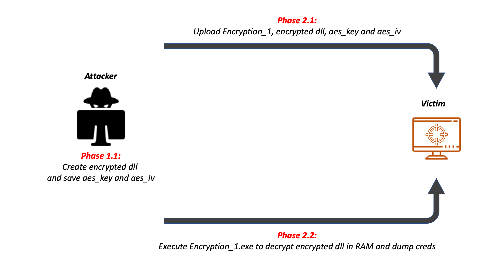

# Encryption\_1

## What is it?

Encryption\_1 is an AV program that can be useful in post exploitation operations in order to load [SharpSploit](https://github.com/cobbr/SharpSploit). Moreover, can ben used to load and execute standalone powershell script.

## How does it work?

Encryption_1 works in two phases:

1. On the attacher machine:
	1. Use Encryption\_1 to encrypt SharpSploit.dll with aes symmetric encryption and save aes key and aes iv files.
2. On the target machine:
	1. Upload Encryption\_1, SharpSploit.dll.enc, aes key and aes iv
	2. Run Encryption\_1 to load the encrypted dll in RAM

The work flow of the application can be found here:

## Why does it not detected by AV?

Sharpsploit dll cannot be detected by "standard" AV because the file is encrypted and cannot be parsed from the antivirus.

## Which program can detect it?

The only way to detect Sharpsploit is using a RAM inspector antivirus.

## Why does the Encryption\_1's code not available?

The Encryption\_1's code is not available because it is simple to write, anyone can write it. Moreover, in this way there will be less submissions of the same code on Virustotal :)
